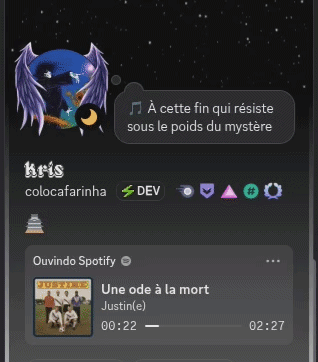

# DisGOrd Lyrics

[](https://github.com/kristyancarvalho/disGOrd-lyrics/actions/workflows/release.yml)
[](LICENSE)
[](go.mod)
[](https://github.com/kristyancarvalho/disGOrd-lyrics/releases)
[](https://github.com/kristyancarvalho/disGOrd-lyrics/milestones)

## What it does

DisGOrd Lyrics shows the current synchronized lyric line as your Discord custom status while music is playing.

It reads the active media player, finds synchronized lyrics through LRCLIB, and updates the status only when the lyric changes. It can clear the status when playback pauses, stops, or the app exits.



## Before you start

### Discord account warning

Discord does not provide an official way for this app to change a user's custom status. DisGOrd Lyrics uses an undocumented Discord endpoint and requires your Discord user token.

Discord can change or block this method at any time.

Your Discord token gives access to your account. Do not share it. Using a user token for automation may violate Discord's Terms of Service and may put your account at risk.

The original project includes a video tutorial showing the Discord token setup process. The relevant part starts at 2:30: https://www.youtube.com/watch?v=5RDWmaV7O2U&t=150s

Only use a credential from your own account. Never share it, post it, include it in screenshots, or commit a filled configuration file to Git.

### Supported platforms

| Platform | Status |
|----------|--------|
| Linux amd64 | Supported through MPRIS |
| Linux arm64 | Supported through MPRIS |
| Windows amd64 | Supported through Windows media controls |

## Downloads

Download the latest files from [GitHub Releases](https://github.com/kristyancarvalho/disGOrd-lyrics/releases).

Choose the file for your computer:

- Linux on most PCs: `disgord-lyrics-vX.Y.Z-linux-amd64.tar.gz`
- Linux on ARM64 devices: `disgord-lyrics-vX.Y.Z-linux-arm64.tar.gz`
- Windows: `disgord-lyrics-vX.Y.Z-windows-amd64.zip`

The release also includes `checksums.txt`. On Linux, verify the downloads before installing:

```sh
sha256sum -c checksums.txt --ignore-missing
```

## Windows installation

1. Download the Windows `.zip` from [GitHub Releases](https://github.com/kristyancarvalho/disGOrd-lyrics/releases).
2. Right-click the file and select **Extract All**.
3. Move the extracted folder somewhere permanent, such as:

```text
C:\Users\YOUR_USER\AppData\Local\DisGOrd Lyrics
```

4. Open PowerShell in that folder.
5. Create the configuration:

```powershell
.\disgord-lyrics.exe init
```

6. Print the configuration location:

```powershell
.\disgord-lyrics.exe config-path
```

7. Open that file in Notepad and add your Discord token.
8. Start Spotify or another player that appears in Windows media controls and play a song.
9. Start DisGOrd Lyrics:

```powershell
.\disgord-lyrics.exe run
```

Keep the PowerShell window open. DisGOrd Lyrics reads the active Windows media session and updates the lyric as playback moves.

## Linux installation

1. Download the correct Linux `.tar.gz` from [GitHub Releases](https://github.com/kristyancarvalho/disGOrd-lyrics/releases).
2. Open a terminal in the download folder.
3. Extract the archive:

```sh
tar -xzf disgord-lyrics-vX.Y.Z-linux-amd64.tar.gz
```

For an ARM64 download, replace `linux-amd64` with `linux-arm64`.

4. Install the binary for your user:

```sh
install -Dm755 disgord-lyrics ~/.local/bin/disgord-lyrics
```

5. Confirm it works:

```sh
disgord-lyrics version
```

If the command is not found, see [Command not found](#command-not-found).

## Arch Linux installation

Install `disgord-lyrics-bin` with an AUR helper:

```sh
paru -S disgord-lyrics-bin
```

or:

```sh
yay -S disgord-lyrics-bin
```

After installation, continue with [First-time setup](#first-time-setup).

## First-time setup

Create the configuration file:

```sh
disgord-lyrics init
```

Print its location:

```sh
disgord-lyrics config-path
```

Default locations:

- Linux: `~/.config/disgord-lyrics/config.toml`
- Windows: `%ProgramData%\DisGOrd Lyrics\config.toml`
- Windows fallback: `%APPDATA%\DisGOrd Lyrics\config.toml`

Open the file in a text editor and place your Discord token between the quotes:

```toml
[discord]
token = ""

[status]
prefix = "🎵 "
max_length = 70
clear_on_pause = true
clear_on_exit = true

[lyrics]
provider = "lrclib"
offset_ms = 500

[polling]
interval_ms = 300

[logging]
level = "info"
```

Save the file. Do not share it after adding the token.

The `init` command will not replace an existing configuration. `disgord-lyrics init --force` replaces it with a blank template and removes the saved token.

## Running the app

Start DisGOrd Lyrics:

```sh
disgord-lyrics run
```

Keep the terminal open while the app runs. To stop it, press `Ctrl+C`. The app clears the Discord status on exit when `clear_on_exit` is enabled.

Available commands:

```sh
disgord-lyrics run
disgord-lyrics init
disgord-lyrics init --force
disgord-lyrics config-path
disgord-lyrics version
disgord-lyrics help
```

## Start automatically with the system

### Linux

Use the [Linux systemd setup guide](docs/linux-startup.md). It creates a service for your user and does not require root access.

Stop the background service:

```sh
systemctl --user stop disgord-lyrics.service
```

Disable automatic startup:

```sh
systemctl --user disable --now disgord-lyrics.service
```

### Windows

The [Windows startup guide](docs/windows-startup.md) explains the Startup folder and Task Scheduler methods.

## Updating

1. Stop the running app with `Ctrl+C`, or stop the Linux service:

```sh
systemctl --user stop disgord-lyrics.service
```

2. Download the new archive from [GitHub Releases](https://github.com/kristyancarvalho/disGOrd-lyrics/releases).
3. Extract it.
4. Replace the old binary with the new one.

On Linux:

```sh
install -Dm755 disgord-lyrics ~/.local/bin/disgord-lyrics
```

5. Start the app or service again:

```sh
systemctl --user start disgord-lyrics.service
```

Your existing configuration is kept during an update.

## Troubleshooting

### Command not found

Run the binary by its full path:

```sh
~/.local/bin/disgord-lyrics version
```

If that works, add `~/.local/bin` to your shell's `PATH`, then open a new terminal.

### Configuration file not found

Create it:

```sh
disgord-lyrics init
```

Then find it:

```sh
disgord-lyrics config-path
```

### Discord token is required

Open the configuration file and set a non-empty `discord.token`. Keep the quotes around the value.

### No media is detected on Linux

The player must support MPRIS and run in the same desktop session as DisGOrd Lyrics. Check for a player:

```sh
busctl --user list | grep org.mpris.MediaPlayer2
```

Try starting music before starting DisGOrd Lyrics.

### Lyrics are missing

LRCLIB may not have synchronized lyrics for the exact title and artist reported by the media player. The app continues running and tries again when the song changes.

### Discord returns an HTTP error

The token may be invalid, Discord may be rate limiting requests, or Discord may have changed its undocumented endpoint.

### No media is detected on Windows

Use Windows 10 version 1809 or newer, or Windows 11. Start playback before running DisGOrd Lyrics and confirm the player appears in the Windows media controls. Spotify and other compatible players should expose the title, artist, playback position, and playback state.

## Uninstalling

### Linux

Stop and remove the user service if it was enabled:

```sh
systemctl --user disable --now disgord-lyrics.service
rm -f ~/.config/systemd/user/disgord-lyrics.service
systemctl --user daemon-reload
```

Remove the binary and configuration:

```sh
rm -f ~/.local/bin/disgord-lyrics
rm -rf ~/.config/disgord-lyrics
```

Removing the configuration permanently deletes the saved Discord token and settings.

### Windows

1. Remove any Startup folder shortcut or Task Scheduler task.
2. Delete the folder containing `disgord-lyrics.exe`.
3. Delete `%ProgramData%\DisGOrd Lyrics` or the fallback `%APPDATA%\DisGOrd Lyrics` folder.

## For developers

```sh
go test ./...
make build
make dist
```

## Credits

DisGOrd Lyrics was inspired by [Discord-Lyrics-Selfbot-Status](https://github.com/5dwn/Discord-Lyrics-Selfbot-Status), a Python project that demonstrated the idea of reading Windows media controls and updating Discord custom status with synchronized lyrics.

This project reimplements the idea in Go, adds Linux support, release binaries, configuration files, and packaging improvements.

DisGOrd Lyrics is released under the [MIT License](LICENSE).
